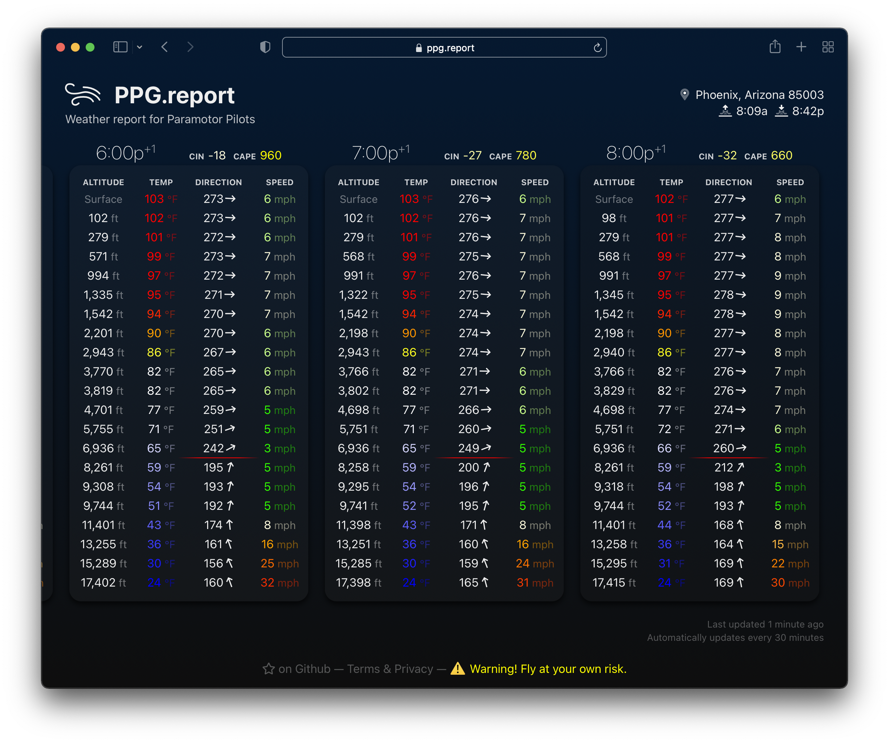

```diff
- ⚠️ Warning! Fly at your own risk.
```


# [🪂 PPG.report](https://ppg.report)

Weather report tailored for paramotor pilots. Uses the [NOAA rapid refresh Op40 analysis](https://rucsoundings.noaa.gov/).



## Available Scripts

In the project directory, you can run:

### `yarn start`

Runs the app in the development mode.
Open [http://localhost:3000](http://localhost:3000) to view it in the browser.

The page will reload if you make edits.\
You will also see any lint errors in the console.

### `yarn test`

Launches the test runner in the interactive watch mode.\
See the section about [running tests](https://facebook.github.io/create-react-app/docs/running-tests) for more information.

### `yarn build`

Builds the app for production to the `build` folder.\
It correctly bundles React in production mode and optimizes the build for the best performance.

The build is minified and the filenames include the hashes.\
Your app is ready to be deployed!

See the section about [deployment](https://facebook.github.io/create-react-app/docs/deployment) for more information.

## Deploying

Using a reverse proxy such as Nginx, configure the following:

- Serve `index.html` for 404 requests, no caching
  - Aggressively cache `/static`
- Create the following reverse proxy endpoints:
  - GET `/api/position/search` ➡ `https://nominatim.openstreetmap.org/search`
  - GET `/api/position/reverse` ➡ `https://nominatim.openstreetmap.org/reverse.php`
  - GET `/api/rap` ➡ `https://rucsoundings.noaa.gov/get_soundings.cgi`
  - GET `/api/rap` ➡ `https://rucsoundings.noaa.gov/get_soundings.cgi`
  - GET `/api/timezone` ➡ `http://api.timezonedb.com/v2.1/get-time-zone` (You will need to attach an API key. Note: This API is only used as a fallback for when the `/api/weather` endpoint fails.)
  - GET `/api/aviationweather` ➡ `https://www.aviationweather.gov/adds/dataserver_current/httpparam`
  - GET `/api/weather/{proxy+}` ➡ `https://api.weather.gov/{proxy}` Greedy path capturing, forwards to api.weather.gov.
- **IMPORTANT!** For each outgoing API request, make sure to:
  - Attach a `User-Agent` header, as per [NOAA](https://www.weather.gov/documentation/services-web-api) and [Nominatim](https://operations.osmfoundation.org/policies/nominatim/) usage policies.
  - **Keep these free APIs free - be a good API consumer!** Add caching for each route - I recommend at least 10 minutes for `rucsoundings.noaa.gov`, and one week for `nominatim.openstreetmap.org`.
